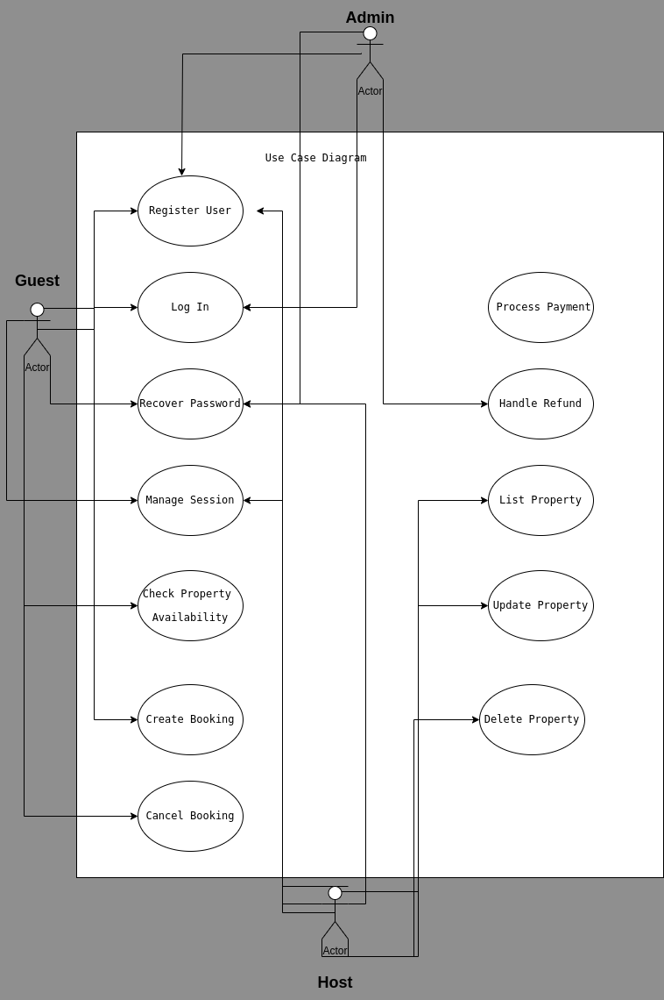

# requirement-analysis

## What is Requirement Analysis?

Requirement Analysis is the process of defining, documenting, and managing the needs and requirements of stakeholders to meet specific objectives. It is a critical phase in the software development lifecycle (SDLC) because it ensures that the development team understands what the customer wants and needs.

Importance in the SDLC:

*   **Clear Understanding:** Requirement Analysis ensures that all stakeholders have a clear and shared understanding of the project's goals and objectives.
*   **Reduced Rework:** By identifying and resolving issues early in the development process, Requirement Analysis helps to reduce the amount of rework needed later on.
*   **Improved Quality:** A well-defined set of requirements leads to a higher quality product that meets the needs of the customer.
*   **Cost Savings:** By preventing misunderstandings and errors, Requirement Analysis can help to save time and money.
*   **Better Communication:** Requirement Analysis facilitates better communication between stakeholders, including customers, developers, and project managers.

## Why is Requirement Analysis Important?

Requirement Analysis is critical in the SDLC for several key reasons:

*   **Ensures Project Alignment:** It ensures that the project aligns with the stakeholders' needs and expectations, reducing the risk of delivering a product that doesn't meet their requirements.
*   **Reduces Development Costs:** By identifying and addressing potential issues early on, Requirement Analysis helps to minimize costly rework and delays later in the development process.
*   **Improves Product Quality:** A thorough Requirement Analysis leads to a better understanding of the problem domain, resulting in a higher quality product that is more likely to satisfy the customer's needs.

## Key Activities in Requirement Analysis

Requirement Analysis involves several key activities:

*   **Requirement Gathering:** Collecting requirements from various sources, including stakeholders, documentation, and existing systems.
*   **Requirement Elicitation:** Discovering and uncovering hidden or implicit requirements through techniques like interviews, surveys, and workshops.
*   **Requirement Documentation:** Recording and organizing requirements in a clear and concise manner, often using templates or tools.
*   **Requirement Analysis and Modeling:** Analyzing and refining requirements to ensure they are complete, consistent, and feasible, and creating models to represent them visually.
*   **Requirement Validation:** Verifying that the requirements accurately reflect the stakeholders' needs and expectations through reviews, testing, and prototyping.

## Types of Requirements

### Functional Requirements

Functional requirements describe what the system should do. They define the specific functions or features that the system must provide.

Examples for a booking management project:

*   The system should allow users to search for available bookings.
*   The system should allow users to create new bookings.
*   The system should allow users to cancel existing bookings.

### Non-functional Requirements

Non-functional requirements describe how the system should work. They specify the quality attributes of the system, such as performance, security, and usability.

Examples for a booking management project:

*   The system should be responsive and load pages in under 3 seconds.
*   The system should be secure and protect user data from unauthorized access.
*   The system should be user-friendly and easy to navigate.

## Use Case Diagrams

Use Case Diagrams are a type of UML (Unified Modeling Language) diagram that visually represents the interactions between actors (users or external systems) and the system. They illustrate the different use cases or functionalities that the system provides.

Benefits of Use Case Diagrams:

*   **Clear Communication:** They provide a clear and concise way to communicate the system's functionality to stakeholders.
*   **Requirement Validation:** They help to validate that the requirements are complete and consistent.
*   **System Design:** They serve as a basis for system design and development.

## Acceptance Criteria

Acceptance criteria are a set of predefined requirements that must be met to consider a feature or functionality complete and acceptable to the stakeholders. They define the boundaries of the feature and provide a clear understanding of what constitutes success.

Importance of Acceptance Criteria in Requirement Analysis:

*   **Clear Expectations:** They ensure that everyone involved has a clear understanding of what needs to be delivered.
*   **Testability:** They provide a basis for testing and verifying that the feature meets the requirements.
*   **Reduced Ambiguity:** They minimize ambiguity and prevent misunderstandings between stakeholders.

Example of Acceptance Criteria for the Checkout Feature:

*   The user should be able to select a payment method.
*   The system should calculate the total cost of the booking, including taxes and fees.
*   The system should process the payment securely.
*   The system should display a confirmation message to the user.
